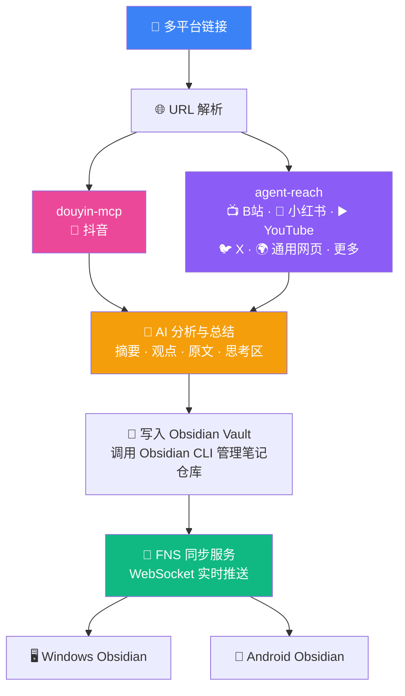

# 链接收纳 (link-vault)

> 发一个抖音/B站/小红书/YouTube/Twitter/网页链接，AI 自动爬取 → 分析总结 → 存入 Obsidian → FNS 同步到所有设备。



---

## 组件一览

| # | 组件 | 用途 | 仓库 |
|---|------|------|------|
| 1 | **FNS (Fast Note Sync Service)** | 多端笔记同步服务 + MCP 接口 | [haierkeys/fast-note-sync-service](https://github.com/haierkeys/fast-note-sync-service) |
|   | **Obsidian Fast Note Sync 插件** | Obsidian 客户端同步插件 | [haierkeys/obsidian-fast-note-sync](https://github.com/haierkeys/obsidian-fast-note-sync) |
| 2 | **agent-reach** | 多平台内容爬取路由（15 平台：B站/小红书/Twitter/YouTube/V2EX 等） | [Panniantong/Agent-Reach](https://github.com/Panniantong/Agent-Reach) |
| 3 | **douyin-mcp** | 抖音视频下载 + AI 语音转文字（SiliconFlow SenseVoice） | [yzfly/douyin-mcp-server](https://github.com/yzfly/douyin-mcp-server) |
| 4 | **Obsidian Skills**（obsidian-cli / obsidian-markdown / obsidian-bases） | Agent 操控 Obsidian：笔记读写、Obsidian 风格 Markdown、.base 数据库视图 | [kepano/obsidian-skills](https://github.com/kepano/obsidian-skills) |
---

## 安装与使用

按顺序安装以下组件：

### 1. agent-reach — 多平台爬取

全平台内容获取路由，覆盖 B站、小红书、YouTube、Twitter/X、通用网页等。内部已集成 opencli、bili-cli、twitter-cli、yt-dlp、Jina Reader 等工具。

> 安装后运行 `agent-reach doctor --json` 检查各平台后端状态。浏览需登录的网站（B站/小红书等）还需安装 [OpenCLI Chrome 扩展](https://github.com/jackwener/opencli/releases)，并在 Chrome 中保持登录。

🔗 [Panniantong/Agent-Reach](https://github.com/Panniantong/Agent-Reach)

### 2. douyin-mcp — 抖音视频提取

抖音视频信息获取 + AI 语音转文字（SiliconFlow SenseVoice / 阿里云百炼）。

> ⚠️ `mcp` 必须锁定 **1.20.0** 版本（2.0 删了 FastMCP 模块），建议用本地 venv 直连，不要通过 `uvx`。

需配置环境变量 `DASHSCOPE_API_KEY` 或 `API_KEY`。

🔗 [yzfly/douyin-mcp-server](https://github.com/yzfly/douyin-mcp-server)

### 3. Obsidian Skills — 操控 Obsidian

Agent 通过 obsidian-cli 读写笔记、管理仓库。agent 内置，无需额外安装。

> 需要 Obsidian 正在运行。

🔗 [kepano/obsidian-skills](https://github.com/kepano/obsidian-skills)

### 4. link-vault — 链接收纳 Skill

将本项目 `skill/SKILL.md` 安装到 agent。

🔗 本项目

### 5. FNS — 多端同步

**服务端**：下载 [Release](https://github.com/haierkeys/fast-note-sync-service/releases) 直接运行：
```bash
./fast-note-sync-service.exe run -c config/config.yaml
```

**Obsidian 插件**：社区插件市场搜索 `Fast Note Sync`。

**MCP Token**：⚠️ 必须手动新建 Token，Scope 留空（GUI 的「Copy API Config」不含 MCP 权限）。

> Android 端注意：热点网段隔离 + 防火墙放行 9000 端口。代理软件（Clash 等）可能干扰 WebSocket。

🔗 服务端 [haierkeys/fast-note-sync-service](https://github.com/haierkeys/fast-note-sync-service) · 插件 [haierkeys/obsidian-fast-note-sync](https://github.com/haierkeys/obsidian-fast-note-sync)

### 开始使用

```
/link-vault <链接>
```

支持：抖音、B站、小红书、YouTube、Twitter/X、以及任意网页链接。

AI 自动识别平台、爬取、分析、写入 Obsidian，FNS 实时同步到所有设备。

## 笔记格式

```markdown
---
platform: <平台名>
source: <原始链接>
date: YYYY-MM-DD
tags:
  - <平台标签>
  - <关键词>
---

# <标题>

> [!abstract] AI 摘要
> 一句话概括核心内容

## 📝 原始内容
<完整字幕/正文 + 视频信息>

## 💡 关键观点
- 观点 1
- 观点 2

## 🤔 我的思考
<!-- 在此记录你的想法 -->
```

---

## 安装与配置困难清单

> 按时间线记录。每个困难都附带根因分析和最终解决方案，供后续遇到类似问题参考。

---

### 一、抖音视频内容获取

| 困难 | 根因 | 解决 |
|------|------|------|
| `WebFetch` 只能拿到标题/标签，拿不到视频字幕 | 抖音字幕不在 HTML 中，需要 ASR 语音识别 | 搭建 `douyin-mcp-server`，通过 SiliconFlow SenseVoice API 做语音转文字 |
| `uvx` 安装的 `mcp` 2.0.0 删了 `FastMCP` 模块，服务启动即崩 | `uvx` 从 PyPI 拉最新版依赖，与作者写代码时的版本不兼容 | 本地 venv 中把 `mcp` 降级到 **1.20.0**，mcp.json 改直连本地 Python 而非 `uvx` |
| SiliconFlow API 返回 HTTP 402 余额不足 | 免费额度用完 | 充值 |
| 另一个 agent 用 `uv run` 跑同样配置也超时 | `uv run` 重新解析依赖拿到 mcp 2.0.0 | 改直连本地 Python venv |

> **关键认知**：`uvx` / `uv run` 不会复用已有 venv，会从 PyPI 重新拉依赖。依赖版本发生 breaking change 时无声地坏掉。**直连本地控制好的 venv 才可控。**

---

### 二、FNS 笔记同步部署（v3.6.0）

| 困难 | 根因 | 解决 |
|------|------|------|
| `bootstrap` 命令不存在 | v3.6.0 已移除该命令 | `config.yaml` 预置在发行包里，直接 `fast-note-sync-service.exe run` |
| Android 用 `192.168.1.125:9000` 连不上 | 电脑有线 + 手机热点是**两个网段**，热点网卡 IP 是 `192.168.137.1` | 手机换 `192.168.137.1:9000` |
| 手机能 ping 通但连不上 | Windows 防火墙拦截 9000 端口 | `netsh advfirewall firewall add rule name="FNS" dir=in action=allow protocol=TCP localport=9000` |
| Obsidian 插件连不上（代理干扰） | Mihomo/Clash 代理劫持了 WebSocket 连接 | 关闭 Clash |

> **关键认知**：Windows 热点创建的虚拟网卡和主网卡在不同子网，手机必须用热点网关 IP。代理软件可能干扰 WebSocket。

---

### 三、FNS MCP 连接

| 困难 | 根因 | 解决 |
|------|------|------|
| `Scope restricted: Permission denied: /api/mcp` | Web GUI "Copy API Config" 生成的 Token 默认 Scope 只含 `p:rest`，不含 `p:mcp` | 手动创建 Token，**Scope 留空**（空 = 全权限 `p:* c:* f:*`） |
| 换了 Scope 留空的 Token 仍报 Scope Restricted | 第一次点的仍是 "Copy API Config" 而非手动新建，Token 没换 | 去 Token 管理页面真正新建一个空 Scope 的 Token |
| 换了第三个 Token 成功 | Token ID 从 6→7→8，第三个才是真正空 Scope | — |
| FNS MCP SSE 间歇性 `unexpected EOF` | 推测 agent MCP 客户端 SSE 长连接断开 | **不影响同步**：FNS 服务端自动检测文件变更并同步，不依赖 MCP 调用触发 |

> **关键认知**：FNS 权限是三维的（协议 `p:` / 客户端 `c:` / 功能 `f:`），`p:rest` 的 Token 无法访问 MCP 端点。空 Scope = 全权限。FNS 的同步不依赖 MCP 调用——文件写入本地后服务端自动检测变更。

---

### 四、Whisper 模型本地下载（失败但学到了）

| 尝试 | 失败原因 |
|------|----------|
| HuggingFace 直接下载 | LFS 指针文件问题，`curl -L` 拿不到真实文件 |
| `hf-mirror.com` 镜像 | 同样不通 |
| `huggingface_hub` Python 库下载 | 无认证 + 国内网络慢/阻断 |
| `faster-whisper` 本地转录 | 模型下载同样依赖 HF |
| Google SpeechRecognition | 国内不通 |

> **最终方案**：SiliconFlow API 远程转录，本地只做下载和音频提取。

---

### 五、B站视频字幕提取

| 困难 | 根因 | 解决 |
|------|------|------|
| `bili audio` 报 PyAV 缺失 | pipx 隔离环境需单独安装 `av`，且 pipx 在 bash 中路径找不到 | **放弃 bili audio 路径** |
| `bili video --subtitle` 返回 `available: false` | 视频本身无 CC 字幕 | 改用 opencli 提取 |
| `opencli bilibili subtitle` 报 `BROWSER_CONNECT` | Chrome 未打开或 OpenCLI 扩展未连接 | 前置条件：Chrome 打开 + 已登录 B站 + OpenCLI 扩展已启用 |
| bili-cli 报告无字幕但 opencli 拿到了完整字幕 | **两种工具字幕数据源不同**：bili-cli 查 CC 字幕，opencli 还能拿到 AI 自动生成字幕 | **始终先试 opencli**，字幕覆盖率显著更高 |

> **关键认知**：opencli 的字幕覆盖率 > bili-cli。即使 bili-cli 报告无字幕也要试 opencli。

---

### 六、Obsidian 笔记写入

| 困难 | 根因 | 解决 |
|------|------|------|
| `obsidian vault="1" create content="长内容..."` 报 exit 127 | 长内容含 `---`（YAML 分隔符）、`$`、引号等特殊字符，shell 解析异常 | **弃用 obsidian-cli 写笔记** |
| `write_file` 报 sandbox 限制 | agent 的 write_file 工具只允许写工作区内文件，vault 路径在外部 | **用 `bash cat >` heredoc 写文件** |
| heredoc 中 `$` 被 shell 展开 | 未用单引号分隔符 | 必须用 `<< 'ENDOFFILE'`（单引号防变量展开） |

> **关键认知**：obsidian-cli 适合简短的元数据操作（move/search/property），不适合写完整笔记。写笔记统一用 bash heredoc + 单引号分隔符。

---

### 七、FNS MCP 间歇性 EOF（agent 客户端）

`read SSE: unexpected EOF` 间歇性出现（重试后通常恢复），不影响 FNS 服务端同步。FNS 通过 WebSocket 协议实时同步，服务端自动检测本地文件变更。

---

## 一句总结

> **任何通过包管理器自动拉依赖的方案（uvx/uv run），在依赖版本发生 breaking change 时都会无声地坏掉，直连本地控制好的 venv 才可控。**
>
> FNS 权限三维度（`p:` / `c:` / `f:`），默认 Token 不含 MCP 权限；opencli 的字幕覆盖率高过 bili-cli；shell heredoc 单引号写文件比 obsidian-cli 和 write_file 都可靠。FNS 同步不依赖 MCP 调用——文件写入本地后服务端自动检测变更。
